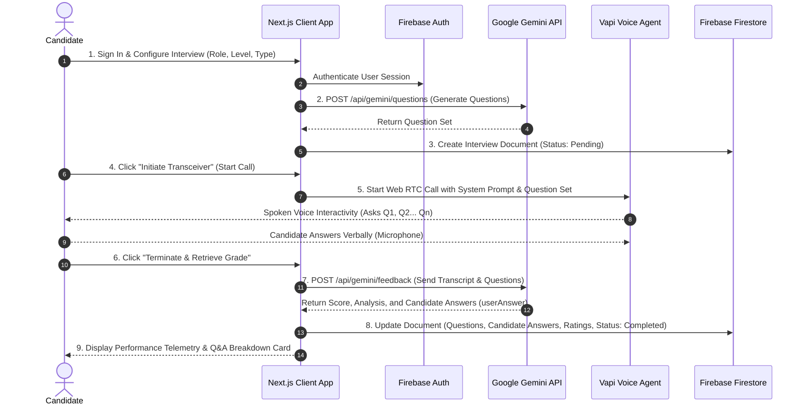

# 🎙️ Mock.ai — Next-Gen AI Voice Mock Interview Platform

[](https://nextjs.org/)
[](https://react.dev/)
[](https://www.typescriptlang.org/)
[](https://tailwindcss.com/)
[](https://firebase.google.com/)
[](https://vapi.ai/)
[](https://ai.google.dev/)

> **Mock.ai** is an autonomous, real-time voice mock interview platform designed to help software engineers, developers, and tech professionals practice high-stakes technical, behavioral, and system design interviews. Powered by **Vapi AI Web Voice SDK** and **Google Gemini**, Mock.ai conducts realistic vocal conversations, captures candidate spoken responses, evaluates performance against senior hiring manager rubrics, and persists complete Q&A telemetry into **Firebase Firestore**.

---

## 🚀 Live Demo

🌐 **Hosted Application**: [https://mock-interview-azure-rho.vercel.app](https://mock-interview-azure-rho.vercel.app)

---

## ⚡ Core Features

- 🎙️ **Conversational Voice Transceiver**: Experience fluid, low-latency vocal interviews with an AI interviewer powered by Vapi AI Web Voice SDK.
- 🎯 **Domain-Specific AI Question Generation**: Dynamically synthesizes tailored interview questions matching candidate experience level (Junior, Mid, Senior) and technical domain (Web, Android, iOS, Backend, DevOps, Data Science, ML, Cloud).
- 💾 **Structured Firebase Q&A Persistence**: Every interview session, question, candidate spoken answer (`userAnswer`), evaluation rating, and targeted feedback is saved into Firebase Firestore.
- 📊 **Senior Hiring Manager Telemetry**: Receives granular performance metrics including overall 0–100 score gauge, strengths detected, actionable improvements, and deep per-question analysis.
- 📈 **Candidate Analytics Dashboard**: Track historical performance metrics, completed sessions, average performance grades, and progress over time.
- 🔐 **Multi-Provider Authentication**: Secure candidate onboarding with Firebase Authentication supporting Google OAuth, GitHub OAuth, and Email/Password credentials.
- 🎨 **Modern Futuristic Blueprint Design**: Built with sleek dark/light mode toggle, glassmorphism, responsive micro-animations, and dynamic audio waveforms.

---

## 🔄 How It Works — End-to-End Architecture



### Workflow Steps:
1. **Interview Configuration**: The candidate specifies their target role (e.g. *Senior Frontend Engineer*), interview type (*Technical*, *Behavioral*, or *System Design*), difficulty level, and focus areas.
2. **AI Question Synthesis**: The server invokes Google Gemini (`gemini-2.5-flash`) via `POST /api/gemini/questions` to generate domain-tailored interview questions calibrated for the chosen difficulty level.
3. **Voice Transceiver Session**: Vapi AI establishes a WebRTC audio connection. The AI interviewer greets the candidate verbally and asks the generated questions sequentially, reacting dynamically to the candidate's spoken responses.
4. **Turn-Boundary Transcript Processing**: The client hook streams audio transcript lines in real time and aligns candidate spoken turns (`You: ...`) with interviewer question turns.
5. **AI Debrief & Telemetry Evaluation**: On call termination, `POST /api/gemini/feedback` analyzes the complete conversation transcript, evaluates correctness, depth, communication clarity, and confidence, and constructs a structured per-question analysis (`questionAnalysis`).
6. **Firebase Persistence & Dashboard**: The complete session state—including questions, candidate answers (`userAnswer`), rating badges (`Excellent`, `Good`, `Needs Improvement`, `Unanswered`), strengths, and overall score—is saved to Firebase Firestore.

---

## 🛠️ Tech Stack & Key Libraries

| Layer | Technology | Description |
| :--- | :--- | :--- |
| **Framework** | Next.js 16.1.6 (App Router) | Server Components, Turbopack, Client Hooks |
| **Language** | TypeScript 5.0 | Strict Typing, Interfaces, Generic Utilities |
| **UI Library** | React 19.2.3 | Functional Components, Custom Hooks |
| **Styling** | Tailwind CSS v4, Lucide Icons | Responsive Design, Blueprint Aesthetic |
| **Voice Engine** | Vapi AI Web SDK (`@vapi-ai/web`) | WebRTC Voice Transceiver & Conversational AI |
| **LLM Intelligence**| Google Gemini API (`@google/generative-ai`) | Question Synthesis & Candidate Evaluation |
| **Database & Auth**| Firebase Firestore & Auth (v12.10.0) | User Management & Session Storage |
| **State Management**| React Context API (`AuthProvider`) | Global Authentication State |

---

## ⚙️ Prerequisites & Environment Setup

Before running the application locally, ensure you have **Node.js 18+** installed.

Create a `.env.local` file in the project root directory with the following environment variables:

```env
# ==========================================
# GOOGLE GEMINI API CONFIGURATION
# ==========================================
GEMINI_API_KEY=your_google_gemini_api_key_here

# ==========================================
# VAPI AI VOICE TRANSCEIVER CONFIGURATION
# ==========================================
NEXT_PUBLIC_VAPI_WEB_TOKEN=your_vapi_public_web_token_here
NEXT_PUBLIC_VAPI_ASSISTANT_ID=your_vapi_assistant_id_here

# ==========================================
# FIREBASE AUTHENTICATION & FIRESTORE CONFIG
# ==========================================
NEXT_PUBLIC_FIREBASE_API_KEY=your_firebase_api_key
NEXT_PUBLIC_FIREBASE_AUTH_DOMAIN=your_project.firebaseapp.com
NEXT_PUBLIC_FIREBASE_PROJECT_ID=your_firebase_project_id
NEXT_PUBLIC_FIREBASE_STORAGE_BUCKET=your_project.appspot.com
NEXT_PUBLIC_FIREBASE_MESSAGING_SENDER_ID=your_sender_id
NEXT_PUBLIC_FIREBASE_APP_ID=your_firebase_app_id
```

> 💡 **API Keys Setup**:
> - **Google Gemini Key**: Get your free API key at [Google AI Studio](https://aistudio.google.com/app/apikey).
> - **Vapi Web Token & Assistant**: Create your assistant at [Vapi Dashboard](https://dashboard.vapi.ai/).
> - **Firebase Credentials**: Create a project in [Firebase Console](https://console.firebase.google.com/), enable Authentication and Firestore Database.

---

## 📥 Getting Started

### 1. Clone the Repository
```bash
git clone https://github.com/sahilsinghpanwar/mock-interview.git
cd mock-interview
```

### 2. Install Dependencies
```bash
npm install
```

### 3. Start Development Server
```bash
npm run dev
```

Open [http://localhost:3000](http://localhost:3000) in your browser to view the application.

### 4. Build for Production
```bash
npm run build
npm run start
```

---

## 📁 Directory Structure

```
mock-interview/
├── app/                        # Next.js App Router Routes & API Handlers
│   ├── (auth)/                 # Authentication Pages (Sign In / Sign Up)
│   ├── api/                    # Serverless API Routes
│   │   └── gemini/             # Gemini AI Endpoints (Questions & Feedback)
│   │       ├── feedback/       # POST /api/gemini/feedback
│   │       └── questions/      # POST /api/gemini/questions
│   ├── dashboard/              # Candidate Dashboard & Historical Analytics
│   ├── interview/              # Interview Creation & Voice Panel View
│   │   ├── new/                # Interview Setup Form Page
│   │   └── [id]/               # Active Voice Session & Feedback Telemetry Page
│   ├── globals.css             # Tailwind Global CSS Rules & Design Tokens
│   └── page.tsx                # Landing Page & Auth Redirect Router
├── components/                 # Reusable UI & Feature Components
│   ├── AudioWaveform.tsx       # Live Audio Visualization Bars
│   ├── AuthGuard.tsx           # Route Protection Guard Component
│   ├── InterviewCard.tsx       # Dashboard Interview Session Card
│   ├── InterviewFeedback.tsx   # Detailed Feedback & Q&A Breakdown Component
│   ├── ScoreGauge.tsx          # Animated Radial Score Indicator
│   └── VoiceInterviewPanel.tsx # Vapi Web Voice Transceiver Panel
├── hooks/                      # Custom React Hooks
│   ├── useAuth.tsx             # Firebase Auth State Context Hook
│   └── useVapiInterview.ts     # Vapi WebRTC Call & Transcript Management Hook
├── lib/                        # Utility Libraries, Types & Firebase Actions
│   ├── auth.actions.ts         # Firebase Sign-In, Sign-Up, OAuth Actions
│   ├── firebase.ts             # Firebase App Initialization & Export
│   ├── interview.actions.ts    # Firestore Document Actions & Q&A Parsers
│   ├── prompts/                # AI Prompt Engineering Logic
│   └── types/                  # TypeScript Domain Models & Interfaces
├── public/                     # Static Assets & Images
├── package.json                # Project Dependencies & Scripts
└── README.md                   # Project Documentation
```

---

## 🗄️ Firebase Firestore Data Schema

Interviews are stored in the `interviews` Firestore collection with the following document structure:

```json
{
  "id": "doc_id_123456",
  "userId": "firebase_auth_uid",
  "role": "Senior Full-Stack Engineer",
  "type": "Technical",
  "difficulty": "Senior",
  "focusArea": "System Architecture & APIs",
  "numQuestions": 3,
  "status": "completed",
  "createdAt": "2026-08-09T12:00:00.000Z",
  "score": 85,
  "feedbackSummary": "Candidate demonstrated strong understanding of distributed caching and API design...",
  "feedbackDetail": "Technical Correctness: 88%. Communication: Clear STAR format...",
  "strengths": [
    "Used exact architectural trade-off comparisons when discussing PostgreSQL vs MongoDB",
    "Structured answers logically with clear problem definition"
  ],
  "improvements": [
    "Mention automated failure recovery strategies when designing caching layers",
    "Keep initial answers under 2 minutes before diving into deep implementation details"
  ],
  "questions": [
    {
      "id": "q-1",
      "text": "How do you handle database migrations in a zero-downtime deployment?",
      "userAnswer": "I use expanding and contracting phase migrations where new columns are added first...",
      "rating": "Good",
      "feedback": "Great explanation of multi-phase schema migrations."
    }
  ],
  "questionAnalysis": [
    {
      "question": "How do you handle database migrations in a zero-downtime deployment?",
      "userAnswer": "I use expanding and contracting phase migrations where new columns are added first...",
      "rating": "Good",
      "feedback": "Great explanation of multi-phase schema migrations."
    }
  ]
}
```

---

## 🛡️ Troubleshooting & FAQs

<details>
<summary><b>1. Microphones / Audio is not connecting during the interview?</b></summary>
Ensure your browser has granted microphone access permissions to `localhost:3000` or your deployment domain. Vapi Web SDK requires an active microphone connection over HTTPS (or localhost).
</details>

<details>
<summary><b>2. What happens if Gemini API key runs out of quota?</b></summary>
Mock.ai includes built-in graceful fallback generators! If the Gemini API key is missing or rate-limited, the system seamlessly switches to structured built-in question pools and turn-boundary transcript analytics without crashing the interview session.
</details>

<details>
<summary><b>3. How do candidate answers get parsed from the transcript?</b></summary>
The backend and frontend utilities (`parseQAPairsFromTranscript` and `extractUserAnswersFromTranscript`) process spoken turn boundaries (`You:`, `Candidate:`, `Interviewer:`) to associate candidate responses with their corresponding question cleanly.
</details>

---

## 📄 License & Credits

Built with ❤️ by **Sahil Panwar** for developers mastering technical interviews.

Released under the **MIT License**.
